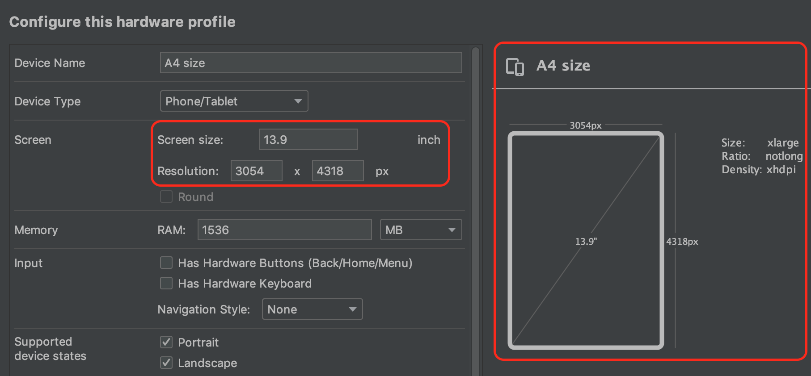
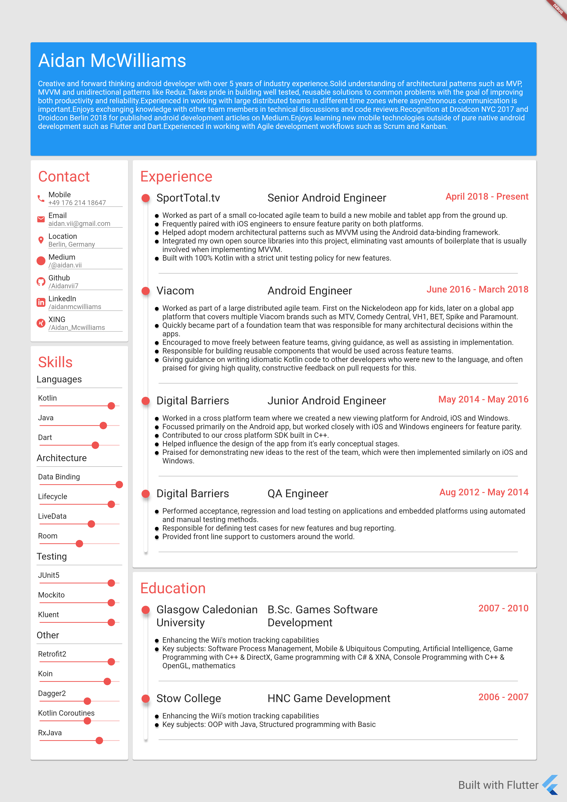

# flutter_resume
A material design themed resume built with Flutter, intended to be used only on certain emulator configurations as it requires a high resolution, specific screen size and aspect ratio (see instructions below).

If you just want to download my resume in image format, get it [here](https://raw.githubusercontent.com/Aidanvii7/flutter_resume/master/resume_snapshot.png).

# Build Instructions
1. Download and install Flutter: https://flutter.dev/docs/get-started/install
4. Run the following command to download project dependencies:
```
flutter pub get
```
5. Run the following command to generate required source files: 
```
flutter packages pub run build_runner build --delete-conflicting-outputs
```
6. Download a recent AVD (Android Virtual Device) from IntelliJ or Android Studio's AVD Manager and use the following configuration:
7. With the android emulator opened, run the following command:
```
flutter run
```

And that's it! You should see the following:

